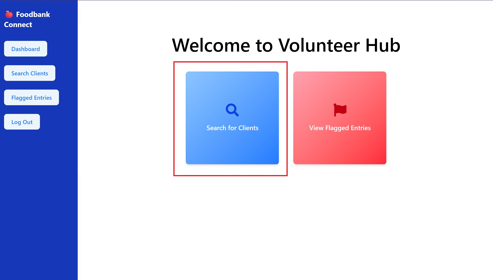
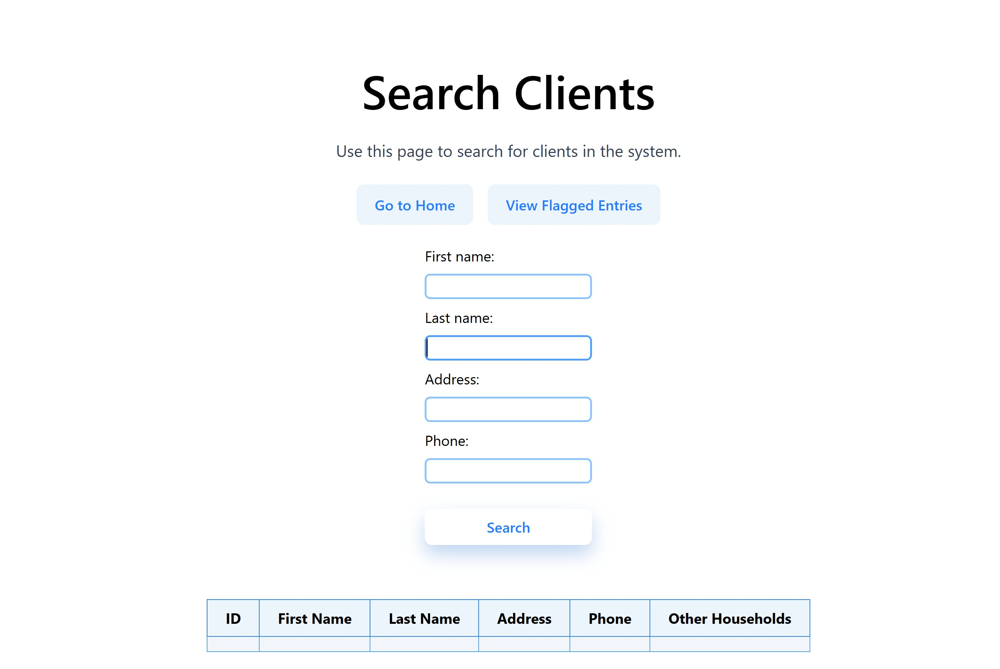
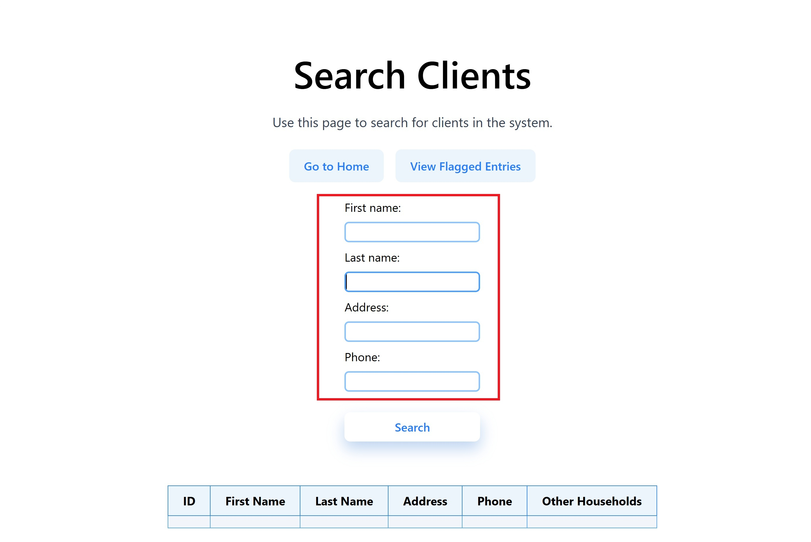
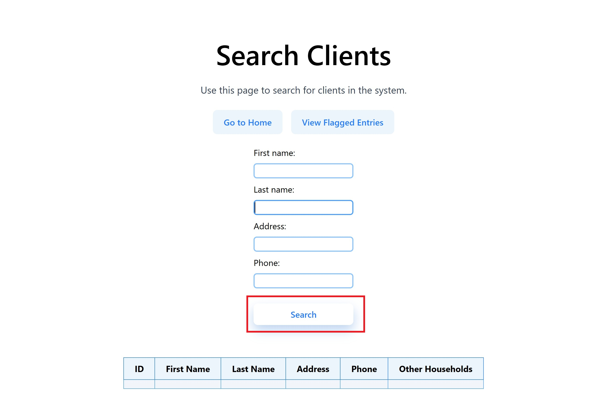
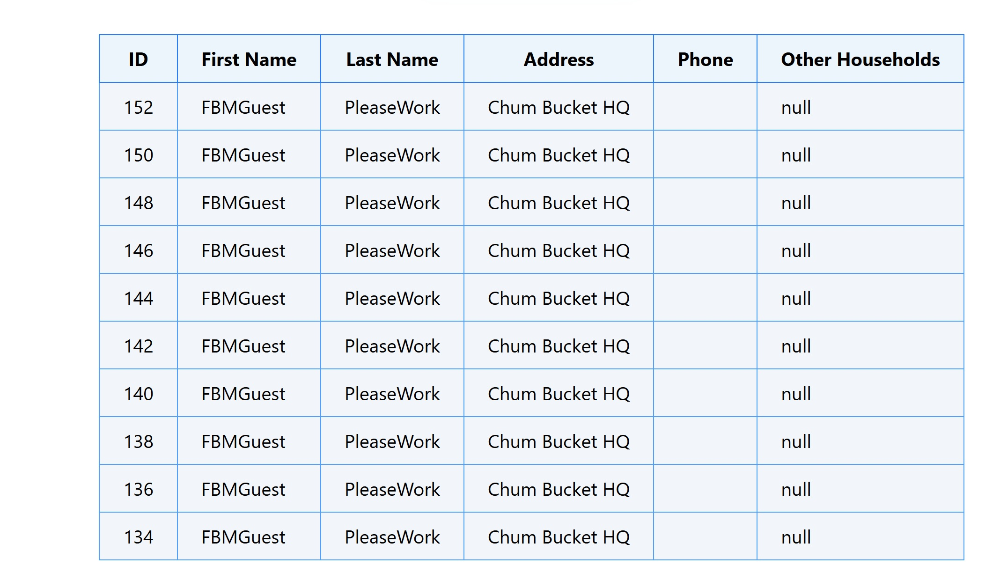
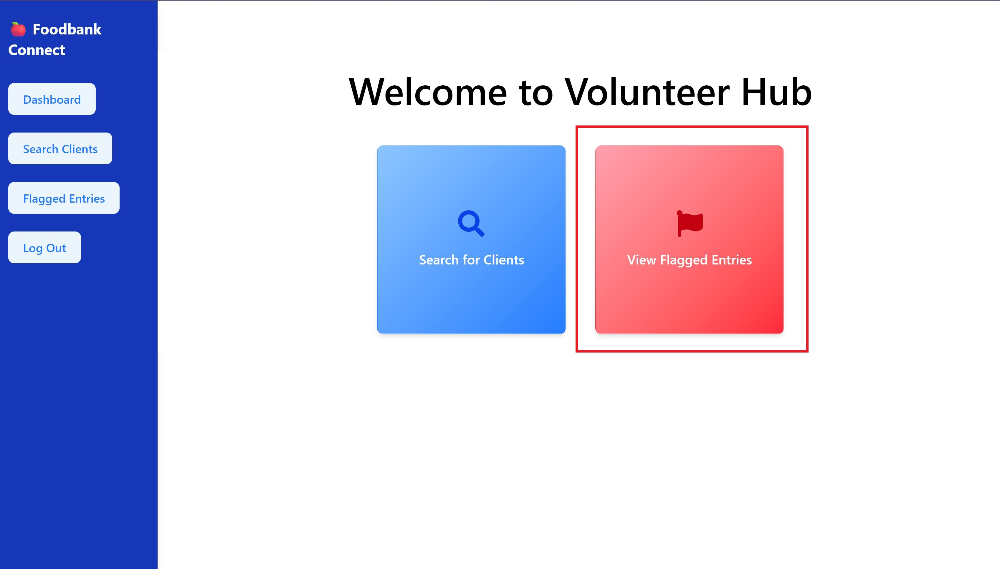
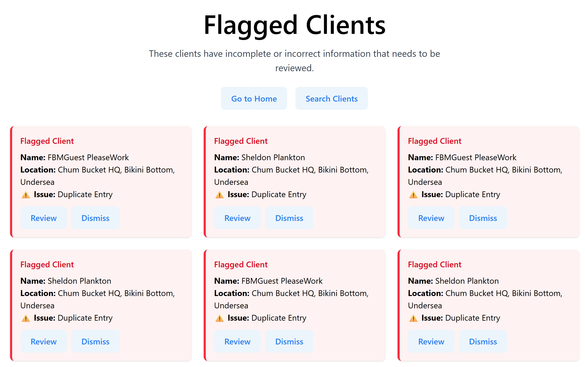
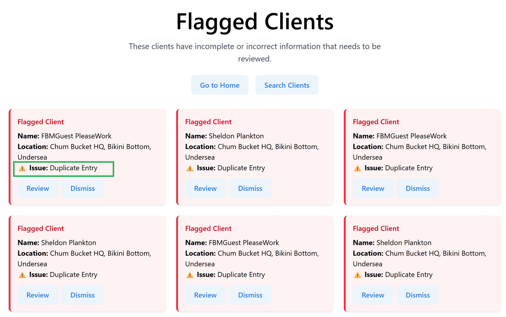

FoodBank Connect for Volunteers

# Table of Contents
1. [Overview](#overview)
2. [Start-Up](#start-up)
3. [Logging In](#logging-in)
4. [Finding a Household](#finding-a-household)
5. [Resolving Suspicious entries](#resolving-suspicious-entries)

# Overview
Welcome to the documentation of FoodBank Connect, a tool designed to
ease your interaction with foodbank guests.  This tool is integrated with 
FoodBank Manager, Lynnwood's database of choice.  Currently, these goals
are supported:
- Find a household in FoodBank Manager using other information than head of household.
- Identify and handle suspicious entries in FoodBank Manager.

There are two features that let you complete these goals:
- Robust searching.
- A flagging system.

# Start-Up
If FoodBank Connect is not currently running, perform these steps:
1. Obtain necessary API keys from administration:
   - *Google* key
2. Clone the repository by ...
3. In the repository, run `npm run start` from the `server/` directory.
4. Run `npm run dev` from the `client/` directory.
5. Verify that the website is up and running.

# Logging In
TODO
To log-in:
1. ...

# Finding a Specific Household
1. Identify the search button, it looks like this:

2. Click the search button, you should see this:

3. From the guest, obtain an identifying piece of information, this can be any of:
   - Head of household's name *(first or last will suffice)*
   - Member of household's name *(first or last will suffice)*
   - Address of household
   - Phone number
4. Identify the search field(s) that correspond to your information.  
The fields can be seen here:

5. Fill out the search fields and press `search`:

You should see something like this:

7. Look for the the correct household.
8. When found, confirm with guest that the household is correct.
   - If incorrect, ask for more information and repeat steps 3 through 8.

Congradulations, you have found the household to serve.

# Resolving Suspicious Entries
1. Identify the `View Flagged Entries` button, it looks like this:

2. Click the `View Flagged Entries` button, you should see something like this:

3. Pick a single flagged entry to address.
4. Identify the reason the entry was flagged. The reason is found here:

5. Based on the reason, resolve as follows:
   - *Duplicate Entry*: Discuss with guest to determine which entry is correct.
If the older version is the correct version, dismiss the entry.  
Otherwise, handle within FoodBank Manager.
   - *Incorrect Information*: Open volunteer's entry within FoodBank Manager,
then discuss the information with the guest.  Modify the entry as required.

6. Repeat steps 3 through 5 until no suspicious entries remain.

Congratulations, you have removed all the suspicious entries.

